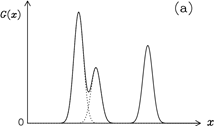
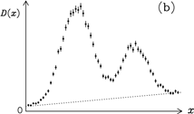

```{r setup, include=FALSE}
knitr::opts_chunk$set(echo = TRUE)
```

## 问题描述
在研究两个变量的线性关系时，我们会讨论如何推断相关直线的系数和截距。然而通常存在另一个问题：二次函数，甚至三次函数是否会更合适？
在现实生活中，我们必须根据相关的背景信息来选择一种功能形式。这可能包括理论上的考虑、校准测量的结果或者仅仅是简化代数的近似；我们如何确定那个更好？

问题类型通常被称为模型选择或模型比较。总的来说，我们可能会认为，可以根据提议的备选方案与数据的吻合程度来做出选择。稍微思考一下很快就会发现一个潜在的困难，即由许多参数定义的更复杂的模型总是能够与实验测量结果更好地吻合。虽然十阶多项式可能比简单的直线更接近一维图形数据，但大多数人更喜欢后者，除非差异非常大。包含了奥卡姆剃刀的精神:“用更少的资源做更多的事情是徒劳的”。但我们又不能一味追求最简单理论。当两种理论都给出与测量相当好的一致性时，奥卡姆因子可以发挥关键作用。如果数据数量少、质量差或者只是未能揭示手头问题的新情况，奥卡姆效应就会失效。

### 与参数估计的比较
参数估计和模型选择之间的区别：在一个很好的近似下，前者需要似然函数最大值的位置，而后者需要计算其平均值。只要λmin和λmax包含λo附近的问题(D|λ，B，I)的有效区域，精确的边界对于估计最优参数无关紧要，并且不需要指定。由于先验范围定义了计算平均似然的域，因此在处理模型选择时需要适当考虑。事实上，正是这种比较“平均”可能性而不是“最大”可能性的行为，将期望的奥卡姆平衡引入拟合优度标准。更复杂模型带来的价值都必须对其额外成本进行权衡。

### 假设检验

传统的做法是引用P值来评估对假设的拒绝程度，但这种正式量化的基础似乎相当可疑。尽管如此，如果拟合质量差促使我们考虑替代假设，那么不匹配的统计数据可以起到有用的(定性)目的；引用Jeffreys(1939年)的话，“如果没有明确说明的替代方案，而无效假设被拒绝，我们就没有任何规则，而无效假设，虽然不令人满意，但无论如何可能显示出与事实的某种对应。”


## 实际应用举例 how many lines are there?
一个经常出现在光谱学、结晶学和许多其他科学领域的案例:即评估一组相关数据中有多少信号峰值的问题。为了简单起见，我们假设我们正在处理一个一维问题，其中信号峰值f(x)的形状是已知的；那么，理想光谱G(x)可以表示为:$$ G(x)=\sum_{i=1}^{M}A_jf(x,x_j)$$

其中Aj是第j条线的幅度，xj代表其位置。例如，如果所有的切点都是宽度为W的高斯分布，那么$$ f(x,x_j)=exp[\frac{-(x-x_j)^2}{2W^2}] $$




大多数实验设置会导致方程中频谱的模糊和噪声，并且倾向于缓慢变化。
在有模糊和噪声的情况下，理想数据{Fk}通过以下方式与参数{Aj，xj}相关：
$$ F_k=\int G(x)R(x_k-x)dx+B(x_k) $$

其中我们隐含地假设分辨率函数(x)的形状不随位置而变化，将模糊过程写成卷积积分。如果我们假设实验测量$Dk$受到独立的加性高斯噪声$\sigma_k$的影响,得到最小二乘似然函数:$$ prob({D_k}|{A_j,x_j,M,I})\propto exp(\frac{-x^2}{2}) $$

这是一个模型选择问题。
为了估计信号峰值的数量，我们需要评估M，prob(M|{Dk}，I)的后验概率密度函数,利用贝叶斯定理: $$ prob(M|{D_k},I)=\frac{prob({D_k}|M,I)\times prob(M|I)}{prob({D_k}|I)} $$

既然我们已经确定了最小二乘似然，我们现在所需要的就是一个先验的赋值。
$x_{min}\leq x_j\leq x_{max}$ and $0\leq A_j\leq A_{max}$

这意味着，为了恰当地归一化，先验由定义的超立方体体积的倒数给出:
$$ prob({A_j,x_j}|M,I)=[(x_{max}-x_{min})A_{max}]^{-M} $$
我们假设所有的线都有相同的，但未知的宽度w。如果我们假设先验概率(W |G，I)和概率(W|L，I)在可比较的范围内(Wmin到Wmax)是一致的，那么这些项将被取消。右边剩余的pdfs可以表示为行数的边际分布:
$$ prob({D_k}|W,G,I)=\sum_M prob({D_k}|M,W,G,I)prob(M|W,G,I) $$

我们不妨指定prob(M|W，G，I) = prob(M|W，L，I) = prob(M|I)。调换积分和求和的顺序
忽略两个候选线形来评估M的证据: 
prob({Dk}|M，I) = prob({Dk}|G，M，I) × prob(G|M，I)+ prob({Dk}|L，M，I) × prob(L|M，I)

## 其他举例
### 均值和方差分析
科学中一个常见的问题是分类问题。例如，一位考古学家可能发现了两组年龄相差一百万年的人形骨骼。一个可能出现的问题是，身体特征的变化，比如他们的大脑大小，是否显示出重大进化变化的证据。假设这两个站点产生N1和N2测量值，分别由数据向量D1和D2表示；然后我们可以考虑以下假设的相对价值:

a:这段时间没有变化，所以两组数据可以用相同(未知)的均值和标准差σ来表征。
b:有变化，两个位点分别有均值1和2，标准差σ1和σ2。

原则上，也有可能均值保持不变，而标准差变化，反之亦然；然而，除非我们有充分的理由期待这种奇特的片面进化，否则我们倾向于给这些命题分配一个相当低的先验概率。因此，通常只考虑上述A和B的情况就足够了；一个更完整的分析，和问题的历史大纲，可以在brethorst(1993)中找到。本质上，我们是说，我们在这里的任务是决定是否所有的头骨属于一个类别或两个明显不同的类别。

我们需要评估prob(D1，D2|A，I)和prob(D1，D2|B，I)从前者开始：
$$ prob(D_1,D_2|A,I)=\iint prob(D_1,D_2|\mu,\sigma|A,I)d\mu d\sigma $$
对于A的先验参数，我们可以在该区域分配一个简单统一的pdf:
$ \mu_{min}\leq\mu\leq\mu_{max}$and $0\leq\sigma\leq\sigma_{max}$,
$$prob(\mu,\sigma|A,I)=[(\mu_{max}-\mu_{min})\sigma]^{-1}$$
否则为零；我们甚至可以让min =0和max =σmax，并将它们设置为测量设备的最大范围。因为我们相信这些变化
除了将数据视为一组N =N1+N2独立测量值{xk}，也可以通过对α的似然函数的对数进行二次泰勒级数展开来近似解析.
假设A的证明简化为:
$$ prob(D_1,D_2|A,I)≈\frac{(\sigma_0\sqrt{2\pi})^{2-N}exp(-N/2)}{(\mu_{max}-\mu{min})\sigma_{max}N\sqrt{2}} $$

我们分类问题需要的另一个量是prob(D1，D2|B，I)。因为假设B断言D1和D2的数据集属于明显不同的类别，所以对其中一个的知识对另一个一无所知；结合概率乘积法则，这种独立性表现为:prob(D1，D2|B，I) = prob(D1|B，I) × prob(D2|B，I)
右手边的两个项都可以写成类似方程(4.21)的边缘积分:
$prob(D_j|B,I)=\iint prob(D_j|\mu_j,\sigma_j,B,I)prob(\mu_j,\sigma_j|B,I)d\mu_j d\sigma_j $

其中j = 1，2。二次泰勒级数展开允许我们通过类似A证明等式的表达式来近似上式右边的概率:
$$ \frac{prob(D_1,D_2|A,I)}{prob(D_1,D_2|B,I)}≈\frac{(\mu_{max}-\mu_{min})\sigma_{max}}{\pi \sqrt{2}}\times \frac{N_1N_2(\sigma)^{2-N}}{N(\sigma{01})^{2-N_1}(\sigma_{02})^{2-N_2}} $$

回到只有两个数据集的情况，我们可以问一个重要的替代问题。例如，假设我们必须在两家灯泡制造商提供的样品基础上进行选择。尽管我们对评估它们的预期寿命(单位成本)之间的差异的重要性感兴趣，但这并不是一个真正的分类问题。我们已经知道产品来自竞争工厂，因此不会有相同的平均值和标准偏差；问题是一种灯泡是否比另一种灯泡耐用。因此，我们需要假设$\mu_1>\mu_2$的后验概率；这可以从以下两种方法的联合pdf中进行评估:
$$ prob(\mu_1>\mu_2|D_1,D_2,I)=\int_{0}^{\infty}d\mu_1\int_{0}^{\mu_1}d\mu_2prob(\mu_1,\mu_2|D_1,D_2,I)$$
如果这个概率非常接近统一，那么我们会从制造商1购买；如果几乎为零，那么竞争对手会更好；0.5级的值表示对两者都没有强烈的偏好。
由于一家工厂的预期寿命知识不能告诉我们另一家工厂的平均性能，因此概率积法则允许我们将上式中的被积函数写成：
$$prob(\mu_1,\mu_2|D_1,D_2,I)=prob(\mu_1|D_1,I)\times prob(\mu_2|D_2,I)$$
如果数据{xk}受到误差线${\epsilon_k}$描述的不确定性的影响，该如何修改分析。这些通常被忽略，因为与σ定义的潜在变化相比，它们很小；例如，虽然特定灯泡的寿命可以测量到几分之一秒，但它可能与样品中的其他灯泡相差几个小时。然而，对于我们无畏的考古学家来说，从头骨碎片中估计大脑大小将是一个不太精确的操作。这可以通过将数据xk的似然函数表示为样本xk的精确但未知的值的边际积分来考虑:

$$prob(x_k|\epsilon_k,\mu,\sigma,I)=\int prob(x_k,hat{x}_k|\epsilon_k,\mu,\sigma,I)=prob(x_k|hat{x}_k\epsilon_k,I)prob(hat{x}_k|\mu,\sigma,I)d\hat{x}_k $$

其中第二行省略了不必要的条件语句。为右侧的两个项分配高斯概率密度函数，我们得到:

$$ prob(x_k,hat{x}_k|\epsilon_k,\mu,\sigma,I)=\frac{1}{\sqrt{2\pi(\epsilon_k^2+\sigma^2)}}exp[-\frac{(x_k-\mu)^2}{2(\epsilon_k^2+\sigma^2)}] $$
一整套独立测量的似然函数将是这些项的乘积；当$\epsilon_k<<\sigma$。通过这种修改，分析的其余部分将像以前一样继续进行。这个问题可以很容易地用数字来解决，或者如果所有的误差条都是相同大小的话，甚至可以用解析的方法来近似($\epsilon_k=\epsilon$,对于所有的k)。

#### 参考文献
[1]D.S.Sivia,Data Analysis A Bayesian Tutorial
