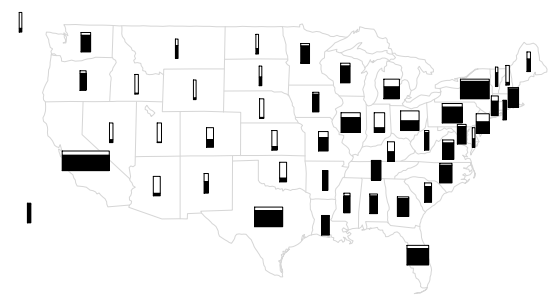

# PART 4  模型检验 Model Checking

模型检验对统计分析至关重要。贝叶斯模型假设了一个概率模型的整个结构，当模型较差时，可能会产生误导性的推论。因此，一个好的贝叶斯分析，应该包括一些对模型与数据的拟合充分性，以及模型用于使用目的的合理性的检验。

在本章，我们将讨论评估后验推断对模型假设的敏感性的方法，并检验概率模型对数据和实质性信息的拟合性。模型检验允许规避贝叶斯推理的形式方法的重复方面，在该方法下，所有的结论都以假设模型的真实性为条件。

# 1 模型检验在贝叶斯统计的应用

## 1.1 敏感性分析与模型改进

敏感性分析的基本问题是：当使用其他合理的概率模型来代替目前的模型时，后验推论会有多少变化？其他合理的模型可能在之前的规范、抽样分布或所包含的信息（例如，回归中的预测变量）中与目前的模型有很大的不同。

模型检验是通过建立一个全面的联合分布来完成的，这样可能观察到的任何数据在联合分布下都是合理的结果。也就是说，这种联合分布是所有可能的“真实”模型或现实的混合物，包含了所有已知的实质性信息。

然而，在实践中，建立这样一个超级模型是不可能的，在计算上也是不可行的。因此，我们有必要以其他方式检验我们的模型。

# 2 来自模型的推断有意义吗？

在任何应用问题中，出于方便或客观的原因，这些知识没有正式包含在先验分布或概率中。如果额外的信息表明后验推断是错误的，那么这就表明有可能为参数和数据收集过程创建一个更准确的概率模型。

> ### 例：通过与现实政治知识的比较来评估选举
>
> 图4.1中显示了1992年10月初做出的预测，比尔·克林顿在当年11月的美国总统选举中赢得每个州的可能性。这些估计是基于层次线性回归模型的后验概率。对于每个州，盒子的阴影部分的高度代表了克林顿赢得该州的估计概率。甚至在选举发生之前，对一些州的预测看起来是错误的；例如，从州的民调来看，克林顿在德克萨斯州和佛罗里达州的预测比地图上显示的要弱得多。这并不意味着预测是无用的，但知道弱点在哪里。当然，在选举后，我们可以更好地修改这个模型，理解它的弱点。
>
> 

## 2.1 外部验证

我们可以通过外部验证来检查模型，对未来的数据进行预测，然后收集这些数据并与它们的预测进行比较。

## 2.2 定义预测量的选择

可以使用单个模型进行不同的预测。例如，在 SAT 示例中我们可以考虑对研究中8所学校的未来数据进行联合预测，$p(\widetilde{y}|y)$，对 8 所新学校 $p(\widetilde{y}_i|y), i = 9,..., 16$，或任何其他新学校的联合预测和现有的学校。其他场景可能有更多不同的选择来定义预测的重点。例如，在抽样调查和设计实验的分析中，考虑使用新的假设重复实验通常是有意义的选择或治疗分配的随机化，类似于经典随机化测试。

# 3 后验预测检验

如果模型拟合，那么在模型下生成的再生数据应该看起来与观察数据相似。换句话说，观察到的数据在后验预测分布下应该是合理的。这实际上是一种一致性检查：观察到的差异可能是由于模型的不拟合或偶然。

检验模型与数据拟合的基本技术是从再生数据的联合后验预测分布中提取模拟值，并将这些样本与观测数据进行比较。模拟和数据之间的任何系统差异都表明了模型的潜在缺陷。

> ### 例：Newcomb 的光速测量结果与先验预测分布比较
> Simon Newcomb 对光速的 66 次测量。在没有其他信息的情况下，我们将测量建模为 $N(µ,σ^2)$，在  $(µ,logσ)$ 上具有无信息均匀先验分布。然而与其余数据相比，Newcomb的最低测量值看起来像是异常值。极端测量值是否合理地来自正态分布？我们通过将观察到的数据与我们期望的数据进行比较来解决这个问题在我们的后验分布下观察到。图4.2显示了20个直方图，每个都代表从后验预测分布中抽取的一个在纽康的实验中的值，通过第一绘制 $(μ，σ^2)$ 其联合后验分布，然后从正态分布中提取66个值这个均值和方差。测量差异的一种方法是将每个假设复制数据集中的最小值与 Newcomb的值进行比较最小观测值，-44。图4.3中的直方图显示了20个假设重复中最小的观测值；所有这些都比纽科姆的最小观测值大得多，这用图上的一条垂直线表示。正常模型显然没有捕捉到Newcomb观察到的变化。修改后的模型可能使用不对称正态分布或对称长尾分布分布代替正态测量模型。
>
> 
>
> 

## 3.1 复制标记法

设 $y$ 为观测数据，$θ$ 为参数向量。为避免与观察到的数据 $y$ 混淆，我们将 $y^{rep}$ 定义为可以观察到的复制数据，或者预测性地思考，作为如果今天产生 $y$ 的实验被复制，我们明天将看到的数据使用相同的模型和相同的 $\theta$ 值产生观察到的数据。

我们区分 $y^{rep}$ 和 $\widetilde{y}$，这是我们预测结果的一般表示法：$\widetilde{y}$ 是任何未来的可观察值或可观察量的向量，而 $y^{rep}$ 是像 $y$ 的复制例如，如果模型有解释变量 $x$，它们将 $y$ 和 $y^{rep}$ 相同，但 $\widetilde{y}$ 可能有自己的解释变量 $\widetilde{x}$。

给定当前知识状态，我们将使用 $y^{rep}$ 的分布，即后验预测分布
$$
p\left(y^{\mathrm{rep}} \mid y\right)=\int p\left(y^{\mathrm{rep}} \mid \theta\right) p(\theta \mid y) d \theta
$$

## 3.2 测试量

我们通过定义测试量来衡量模型和数据之间的差异。测试量或差异度量 $T(y, θ)$ 是标量在比较数据时用作标准的参数和数据摘要预测模拟。测试量在贝叶斯模型检查中发挥作用统计学在经典测试中发挥作用。我们使用符号 $T(y)$ 作为检验统计量，它是一个仅取决于数据的测试量；在贝叶斯中，我们可以概括测试统计以允许依赖模型参数的后验分布。这对于直接总结模型和数据之间的差异非常有用。

## 3.3 尾部区域概率

数据与后验预测分布缺乏拟合可以通过测试量的尾部面积概率或p值来测量，并使用 $(θ,y^{rep})$ 的后验模拟进行计算。我们用数学方法定义p值，首先是对于熟悉的经典检验，然后是在贝叶斯中。

经典p值。检验统计量 $T(y)$ 的经典p值为
$$
p_C = Pr(T(y^{rep})\ge T(y)|\theta)
$$
其中概率是 $θ$ 固定的 $y^{rep}$ 的分布。（给定 $y$ 和 $θ$ 的 $y^{rep}$ 的分布与单独给定 $θ$ 的分布相同。）测试统计数据通常以多种方式推导出来，但通常代表了观测数据与具有 $θ$ 特定值的模型下的预期数据之间差异的汇总度量。这个值可以是一个“零”值，对应于一个“零假设”，或一个点估计，如最大似然值。必须代替 $θ$ 的点估计来计算经典统计量中的p值。

后验p值。为了评估贝叶斯模型的后验分布的拟合性，我们可以将观测数据与后验预测分布进行比较。在贝叶斯方法中，测试量可以是未知参数和数据的函数，因为测试量是通过提取未知参数的后验分布来评估的。贝叶斯p值定义为复制数据可能比观测数据通过测试量测量的更极端的概率：
$$
p_B=Pr(T(y^{rep},\theta)\ge T(y,\theta)|y)
$$
其中概率取自 $θ$ 的后验分布和后验预测 $y^{rep}$  的分布：
$$
p_{B}=\iint I_{T\left(y^{\mathrm{rep}}, \theta\right) \geq T(y, \theta)} p\left(y^{\mathrm{rep}} \mid \theta\right) p(\theta \mid y) d y^{\mathrm{rep}} d \theta
$$
其中 $I$ 是指标函数。在这个公式中，我们使用了预测的性质 $p(y^{rep}|\theta,y)=p(y^{rep}|\theta)$。

> ### 例：光速测量（续）
>
> 我们继续使用其他测试量的这个例子来说明模型的拟合如何取决于被监视的数据和参数的各个方面。图4.4a显示了观察到的样本方差和来自后验预测分布的200个模拟方差的分布。样本方差不能成为一个很好的检验统计量，因为它是模型的充分统计量，因此，在缺乏信息先验分布的情况下，后验分布将自动集中在观测值附近。当我们发现一个估计的p值接近 $\frac{1}{2}$ 时，我们一点也不感到惊讶。
>
> 本章前面基于min$(y_i)$的模型检查表明，正常模型是不够的。为了说明一个模型在某些目的上可能是不够的，但在其他目的上可能是足够的，我们通过考虑基于对分布中心不对称性敏感的测试量的模型检查来评估该模型在极端尾部之外是否足够，
> $$
> T(y,\theta)=|y_{(61)}-\theta|-|y_{(6)}-\theta|
> $$
> 选择第61和6统计数据大约代表90%和10%的分布点。对于对称分布，测试量应分散在零左右。图4.4b中的散点图显示了观测数据的测试量，以及从 $(θ，σ^2)$ 的后验分布模拟200次模拟的模拟数据的测试量。估计的p值为0.26，说明在分布中间观察到的任何不对称性都可以很容易地用抽样变化来解释。
>
> 
>
> 

## 3.4 选择测试量

执行后验预测模型检查的程序需要指定测试数量、 $T(y)$ 或 $T(y,θ)$，以及复制 $y$ 代表的适当预测分布。如果 $T(y)$ 似乎与值 $T(y^{rep 1}) ,…, T(y^{repS})$ 不一致，那么模型正在做出不符合数据的预测。 $T(y)$ 和 $T(y^{rep})$ 的分布之间的差异可以用一个p值来总结，但我们更倾向于观察差异的大小和它的p值。

对于许多问题，数据和参数的函数可以直接以一种仅使用数据函数将会困难的方式处理模型的特定方面。如果测试量取决于 $θ$ 和 $y$，那么测试量 $T(y, θ)$ 及其复制 $T(y^{rep}，θ)$ 是未知的，并由S模拟表示，比较可以显示为 $T(y，θ^s)$ 与值的散点图。$T(y^{rep}，θ^s)$ 或差异的直方图，$T(y,θ^s)−T(y^{rep},θ^s)$ 。在该模型下，散点图应围绕 $45^◦$ 线对称，直方图应包括0。

因为概率模型可能不能以任何多种方式反映生成数据的过程，因此可以计算各种测试量的后验预测p值，以评估多个可能的模型失败。理想情况下，测试量 $T$ 将被选择来反映模型中与应用推理的科学目的相关的各个方面。通常选择测试量是用来衡量概率模型没有直接处理的数据的特征；例如，样本的排名，或残差与一些可能的解释变量的相关性。

## 3.5 多重比较

我们可能会担心解释多重测试或通过数据检查所选择的测试的显著性水平。我们不进行“多重比较”调整，因为我们使用预测性检查来查看数据的特定方面将如何被期望出现在复制中。如果我们检查几个测试变量，我们就不会对其中一些变量没有被模型拟合感到惊讶——但如果我们计划应用该模型，我们可能会对那些看起来不典型的数据方面感兴趣。我们不关心“1类错误率”——也就是说，以假设为真的条件拒绝它的概率——因为我们使用检查不是为了接受或拒绝模型，而是为了理解它在现实复制中的适用性的极限。

## 3.6 解释后验预测p值

如果一个差异具有实际意义，且其观察值的尾部面积概率接近0或1，则被怀疑，这表明如果模型是真实的，在复制数据时观察到的模式不太可能出现。一个极端的p值意味着不能期望模型能够捕获这方面的数据。p值是一个后验概率，因此可以直接解释——尽管不能解释为Pr（模型是真实的 | 数据）。模型的主要故障，通常对应于极端的尾部面积概率（小于0.01或大于0.99），可以通过适当地扩展模型来解决。较小的失败也可能建议模型的改进，或者如果失败似乎不影响主要推论，则可能在短期内被忽略。在某些情况下，如果模型的错拟合与模型内的变化相比相当小，即使是极端的p值也可能被忽略。我们通常会根据几个测试量来评估一个模型，我们应该对这种实践的含义很敏感。

如果一个p值接近于0或1，那么它的极端程度并不那么重要。在实际应用中，p值为0.00001实际上并不比0.001强；在任何一种情况下，由测试量测量的数据方面都与模型不一致。模型略有改进（或纠正数据编码错误！）可以带来任何p值吗到一个合理的范围内（比如说，在0.05到0.95之间）。p值衡量的是“统计意义”，而不是“实际意义”。后者取决于观察数据与实质性兴趣尺度上的参考分布的差异，并取决于研究的目标。

相关的目标不是回答“数据来自假设的模型吗？”（答案几乎总是否定的），而是为了量化数据和模型之间的差异，并评估它们是否可能是在模型自己的假设下偶然产生的。

## 3.7 后验测试局限性

找到一个极端的p值，从而“拒绝”一个模型永远不是分析的结束；所讨论的测试量与其后验预测分布的偏离往往会意味着改进模型或检查数据的地方，如光速的例子。此外，即使当前的模型似乎适合于推断（模型和数据之间没有异常的偏差），下一步科学步骤往往将是更严格的实验，从而提供更好的数据。例如，在教育测试示例中，数据不允许拒绝所有θj都相等的模型，但这个假设显然是不现实的，因此我们不将τ限制为零。

最后，在预测检查中发现的差异应在其应用环境中加以考虑。一个明显错误的模型仍然可以用于某些目的。

## 3.8 p值和u值

贝叶斯预测检验通过对未知参数向量 $θ$ 的后验分布进行平均，而不是将其固定在某些估计的 $\hat{θ}$ 上，来推广经典的假设检验。贝叶斯检验不依赖于关键量的构造（即数据的函数和参数的分布独立于模型的参数），也不依赖于渐近结果，因此适用于一般设置。这并不是说测试是自动的；与经典测试一样，测试数量的选择和适当的预测分布需要仔细考虑所考虑的问题所需的推断类型。

在特殊情况下，参数 $θ$ 已知（或估计为非常高的精度）或测试统计量 $T(y)$ 是辅助的（即它仅依赖于观测数据，如果其分布独立于模型的参数）具有连续分布，则后验预测p值 Pr$(T(y^{rep}>T(y)|y)$ 如果模型为真，则具有均匀分布。在这些条件下，p值小于0.1的时间为10%，p值小于0.05的时间为5%的时间，以此类推。更一般地说，当θ的后验不确定性传播到 $T(y|θ)$ 的分布时，p值如果模型成立，更集中在范围的中间：p值更可能接近0.5，而不是接近0或1。(更准确地说，p值的抽样分布已经被证明是比均匀的“随机小变量”。)

为了澄清，我们将一个u值定义为具有$U(0,1)$采样分布的数据 $y$ 的任何函数。一个u值可以在 $θ$ 的分布上取平均值，从而给它一种贝叶斯的味道，但它基本上不是贝叶斯的，因为它不一定被解释为一个后验概率。相比之下，后验预测p值是这样一个概率声明，条件是模型和数据，关于在未来的复制中可能会有什么预期的内容。

p值为u值，因为后验区间为置信区间。正如后验区间一般不是经典置信区间（在声明的概率覆盖条件 $θ$ 的任何值的意义上）一样，贝叶斯p值通常不是u值。

这一特性导致一些人将后验预测检查描述为保守或未校准。我们认为这样的标记没有帮助；相反，我们将p值直接解释为概率。后验预测检查的样本空间是概率和为1的所有可能事件的集合，它来自 $y^{rep}$ 的后验分布。如果后验预测p值是0.4，也就是说，如果我们相信这个模型，我们认为明天的 $T(y^{rep})$的可能性超过今天的 $T(y)$ 。如果我们能够在许多设置下观察到这样的复制，如果我们的模型真的是真的，我们可以收集它们并检查，事实上，当p值为0.4时，这种情况发生40%，当p值为0.3时，这种情况发生30%，以此类推。这些p值和其他基于模型的概率一样校准，例如，“从这对特定的加载骰子中，得到双六的概率是0.11，或者，“奥巴马在2008年大选中赢得了52%以上密歇根州52%的白人选票。”

## 3.9 模型检验和似然原理

在贝叶斯推理中，数据只通过似然函数(即 $p(y|θ)$ 的未知参数 $θ$ )进入后验分布；因此，有时被认为为一种原则，推断应该依赖于似然，而不依赖数据的其他方面。

举一个简单的例子，考虑一个实验，测试55名学生的随机样本，看看他们在测试中的平均分数是否超过了预先选择的80分。进一步假设测试分数是正态分布的，并且已经为µ和σ设置了一些先验分布，即在抽取学生的人群中分数的均值和标准差。想象四种可能的收集方法：(a)简单地对55名学生的随机样本进行测量；(b)顺序随机抽样学生，每个学生停止收集数据，概率为0.02；(c)随机抽样学生固定时间；或(d)继续随机抽样和测量单个学生，直到使用经典t检验的样本平均值与80有显著差异。在设计(c)和(d)中，测量数是一个随机变量，其分布取决于未知参数。

对于手头的特定数据，这四种非常不同的测量协议对应于数据的不同概率模型，但似然函数相同，因此关于 $µ$ 和 $σ$ 的贝叶斯推断并不依赖于数据是如何收集的——如果假设模型是真实的话。但是一旦我们想要检查模型，我们就需要模拟复制的数据，然后采样规则是相关的。对于任何固定的数据集 $y$，后验推理 $p(µ,σ|y)$ 对于所有这些采样模型都是相同的，但复制数据的分布， $p(y^{rep}|µ,σ)$发生了变化。因此，数据的各个方面有可能很适合一个数据收集模型，而另一个数据收集模型则不是另一个模型，即使可能性相同。

## 3.10 边际预测检验

到目前为止，本节的重点是来自联合后验预测分布的复制数据。另一种方法是计算每个边缘预测 $p(\tilde{y}_i | y)$ 数据，以找到异常值或检查总体校准。然后将这些单独的分布与数据进行比较，以找到异常值或检查整体校准。

尾部面积的概率可以计算为每个边缘后验预测
$$
p_i=Pr(T(y_i^{rep})\le T(y_i)|y).
$$
如果 $y_i$ 是标量和连续的，一个自然检验量是 $T(y_i)=y_i$ ，具有尾部面积概率，
$$
p_i=Pr(y_i^{rep}\le y_i|y).
$$
对于有序的离散数据，我们可以计算一个“中间”p值
$$
p_i=Pr(y_i^{rep}< y_i|y)+ \frac{1}{2}Pr(y_i^{rep}= y_i|y).
$$
如果我们组合来自单个数据点的检查，我们通常会看到与上一节中描述的联合检查不同的行为。

一个相关的检查方法是用交叉验证预测分布替换预测分布，对每个数据点与给定的所有其他数据的推理进行比较：
$$
p_i=Pr(y_i^{rep})\le y_i|y_{-i}).
$$
其中，$y_{−i}$ 包含除 $y_i$ 以外的所有其他数据。对于连续数据，如果模型经过校准，交叉验证预测p值具有均匀分布。缺点是，交叉验证通常需要额外的计算。在某些情况下，使用具有完全相同预测因子 $x_i$ 的新个体的边际预测的后验预测检查被称为混合预测检查，可以看到可以弥合交叉验证和完全贝叶斯预测检查之间的差距。

如果边缘后验p值集中在0和1附近，则数据比模型过于分散，如果p值集中在0.5附近，则数据比模型分布不足。观察与边缘后验p值接近0或1相关的个体观察结果也可能会有帮助。另一种方法是条件预测纵坐标
$$
CPO_i=p(y_i|y_{-i})
$$
考虑到当前的模型，这使得不太可能的观测值很低。检查不太可能的观察结果可以深入了解如何改进模型。

# 4 图形后验预测检验

图形模型检查的基本思想是显示数据和来自拟合模型的模拟数据，并寻找真实数据和模拟数据之间的系统差异。三种图形显示方式：

- 直接显示所有数据。

- 显示数据描述或参数推断。这在数据集很大的设置中很有用，我们希望关注模型的一个特定方面的拟合。

- 模型和数据之间差异的残差或其他度量图。

## 4.1 直接显示数据

图6.8重新显示图6.7，而不按增加响应的顺序对行、列和人员进行排序。再次，左列显示观察到的数据，右列显示来自模型的复制数据集。如果没有排序，就很难注意到数据和模型之间的差异，这在图6.7中很容易明显。

## 4.2 显示描述统计或推断

图6.9(a) 90 个患者参数和(b)69个症状参数的直方图，从心理测量模型的后验分布中提取。这些后验估计的直方图与每批参数假设的Beta（2,2)先验密度(覆盖在直方图上）相矛盾，并促使我们切换到混合先验分布。这种与先验分布下的值的隐式比较可以看作是一种后验预测检查，其中模拟一组新的患者和一组新的症状。

## 4.3 残差图和分箱残差图

图6.10(a) 90 个患者参数和(b)69个症状参数的直方图，这是根据一个扩展的心理测量模型估计的。混合物的先验密度（覆盖在直方图上）并不完美，但它们近似对应的直方图要比图6.9中的Beta（2,2）密度要好得多。

## 4.4 图的一般解释作为模型检验

图6.11(a)疼痛缓解评分模型（0=无疼痛缓解，...，5=完全疼痛缓解)的残差(观察到的−预期）与预期值。(b)平均残差与预期疼痛评分，测量值分为20个大小相同的箱子，由预期疼痛评分的范围定义。平均预测误差相对较小(注意y轴的尺度)，但具有一个一致的模式，即低预测过低，高预测过高。虚线表示模型下95%的边界。

# 5 模型检验：以教育测试为例

美国教育考试服务中心（ETS）进行了一项研究，以分析特殊辅导项目对考试成绩的影响。分别进行了随机实验，以评估8所高中的SAT-V（学术能力测试语言）的辅导项目的影响。每项研究的结果变量都是SAT-V特殊管理的分数，SAT-V是一种由教育考试服务机构管理的标准化多项选择题，用于帮助大学做出招生决定；分数可能在200到800之间，平均约为500，标准差约为100。SAT考试旨在抵制专门旨在提高考试成绩的短期努力；相反，它们旨在反映多年教育中所获得的知识和能力。然而，这项研究中的八所学校都认为其短期教练项目在提高SAT分数方面是成功的。此外，之前没有理由相信这八个项目中的任何一个比其他任何项目都更有效，或者有些项目实际上比任何其他项目都更相似。

## 5.1 模型假定

8所学校例子的推理基于几个模型假设：（1）给定 $θ_j$ 和 $σ_j$ 的估计 $y_j$ 的正态性，其中假设值 $σ_j$ 已知；（2） $θ_j$ 先验分布的可交换性；（3）给定 $µ$ 和 $τ$ 的每个 $θ_j$ 先验分布的正态性；（4）以及 $(µ,τ)$ 的超先验分布的均匀性。

当用估计效应和标准误差来总结研究时，通常采用已知方差的正态性假设。设计（随机化、相当大的样本量、早期测试分数的调整）和分析（例如，个体测试分数的原始数据在早期分析中被检查为异常值），在这种情况下，假设似乎是合理的。

第二个假设值得探讨。现实世界的数学假设的解释是θj看到实验的结果之前，没有希望包括模型特征等相信 (a) A学校的影响可能大于学校B 或 (b) 学校A和B的影响比学校A和C更相似。如果学校B和C的学生相似，而A、D、E、F、G、H的学生相似，那么关于项目有效性或学校间差异的普遍接受信息可能表明存在不可交换的先验分布。不寻常类型的详细先验知识（例如，两所学校是相似的，但我们不知道它们是哪所学校）可以建议一个可交换的先验分布，它不是独立和相同分布的组件的混合。在没有任何此类信息的情况下，可交换性假设意味着θj的先验分布可以被认为是来自一个群体的独立样本，该样本的分布被一些超参数索引——在我们的模型中 $(µ,τ)$ ——有它们自己的超先验分布。

第三和第四个假设比前两个更难证明。为什么学校效应是正态分布的，而不是柯西分布的，甚至是不对称分布的，为什么这个先验分布的位置和尺度参数是均匀分布的？数学上的可处理性是选择模型的原因之一，但如果概率模型族不合适，贝叶斯答案可能会产生误导。

## 5.2 后验推论与事实比较

### 推断模型中的参数

当检查模型假设时，我们的第一步是比较效应的后验分布和我们的教育测试的知识。8所学校的估计治疗效果（后验平均值）在5到10分之间，这是合理的值。（测试范围内的分数可以在200分到800分之间。）A学校的效果可高达31分或低至−2分（95%的后验区间）。这两种极端情况似乎都是合理的。我们也可以看其他的总结，但似乎很明显，参数的后验估计并没有违反我们的常识或我们对测试准备课程有限的实质性知识。

### 对预测值的推断

接下来，我们模拟实验假设实验复制的后验预测分布。考虑到我们到目前为止所做的一切，从后验预测分布中抽样几乎是毫不费力的：从$(θ,µ,τ)$的200个模拟中，我们模拟一个假设的复制数据集，$y^{rep}$=$(y_1^{rep},…,y_1^{rep})$，通过从平均 $θ_j$ 和标准差 $σ_j$ 的正态分布中绘制每个 $y_j^{rep}$ 。得到的200个向量 $y$ 代表总结了后验预测分布。

在200个重复中，每所学校的模型生成的参数值 $θ_j$ 都是指导实验的合理结果。模拟的假设观察 $y_j^{rep}$ 范围从−48到63；同样，鉴于我们对这一领域的普遍理解，我们发现这些可能性是合理的。

## 5.3 后验预测检查

如果数据拟合显示严重问题，我们可能有理由怀疑在模型下得到的推论，最大的观察结果28点，与模型下的后验预测分布有多一致？假设我们对教练实验进行200次后验预测模拟，并计算每个实验的最大观察结果，max$_jy_j$ 。如果所有200个模拟都低于28点，那么模型不符合数据的这个重要方面，我们可能会怀疑5.5节中基于正常的推理将学校A的影响缩小了太远。

为了检验模型与数据的拟合，我们检验了以下四个检验统计数据的后验预测分布：8个观察结果中最大的，max$_jy_j$、min$_jy_j$、平均值、mean($y_j$)和样本标准差sd($y_j$)。我们通过来自200个参数和预测数据的模拟值的直方图来近似每个测试统计量的后验预测分布，并将每个分布与测试统计量的观察值和我们对SAT指导项目的实质性知识进行比较。结果如图所示。

总结表明，该模型产生的预测结果与研究中的观测数据相似；也就是说，实际观测结果是该模型产生的预测观测结果的典型特征。

后验预测分布的许多其他功能也可以被检验，如 $y_j^{rep}$ 的个体值之间的差异。或者，如果我们对效应θj有一个特定的偏态先验分布，我们可以基于模拟预测数据的偏态或不对称性构造一个测试量，作为对正态模型的检验。

## 5.4 敏感性分析

模型检查似乎支持了教育测试的后验推断。虽然我们可能确信这些数据并不与模型相矛盾，但这并不足以激发我们对我们一般的实质性结论的完全信心，因为其他合理的模型可能会提供同样好的拟合，但会导致不同的结论。敏感性分析可以用于评估替代分析对后验推断的影响。

### $τ$的均匀先验分布

为了评估$τ$对先验分布的敏感性，我们考虑图5.5，边缘后验密度$p(τ|y)$图，是在实线正一半上$τ$均匀先验密度的假设下得到的。通过将图5.5所示的密度乘以先验密度，可以根据先验分布的其他选择得到$τ$的后验密度。只要先验密度没有急剧达到峰值，并且对$τ$大于10的值没有施加太多的概率质量，后验推论就变化不大。

### 学校效应的正态人口分布

$θ_j$的正态分布假设是为了方便计算，通常情况也是如此。一个自然敏感性分析是考虑长尾替代方案，如 $t$ 为稳健性的检查。必须对任何替代模型进行检查，以确保预测分布仅限于现实的SAT改进。

### 正常可能性

如前所述，以均值和标准差为条件的正常数据假设在本例中不需要也不能受到严重挑战。证明是基于中心极限定理和研究的设计。评估这一假设的有效性将需要获得来自8个实验的原始数据，而不仅仅是表5.2中给出的估计和标准误差。

# 参考文献

[1] Press C . Bayesian Data Analysis, Third Edition[J]. Crc Press, 2005.
